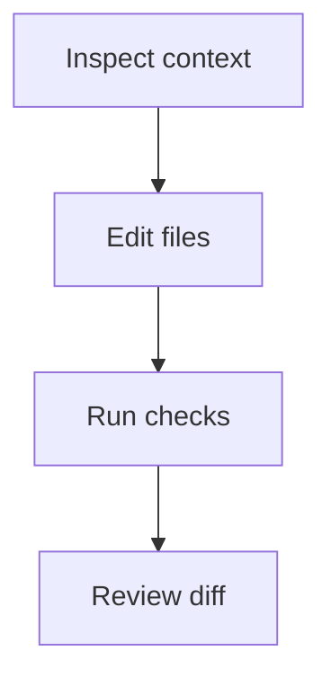
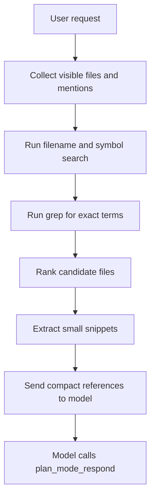
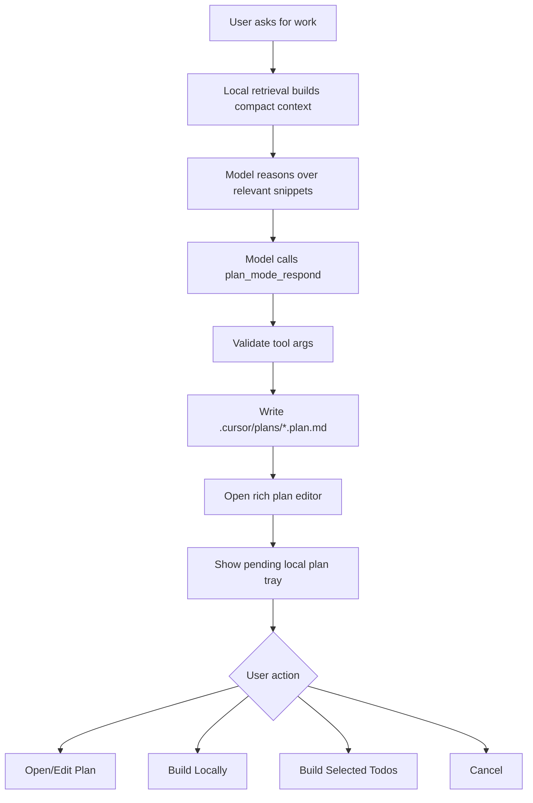

# Local Plan And Build Architecture

This document captures the Cursor-style plan/build workflow for Codie with cloud execution removed. The goal is a local-first flow: gather compact code context, create a reviewable plan, render diagrams and todos, then execute the approved plan in the local agent.

## Product Scope

Codie should support:

- Local codebase retrieval that reads only relevant files and snippets.
- A structured plan-generation tool call.
- Markdown plan files in `~/.cursor/plans`, with `<workspace>/.cursor/plans` as the fallback when the home directory is not writable.
- Rich plan rendering with Mermaid diagrams.
- Editable todos linked to plan execution.
- A local Build button that starts Act mode against the selected plan.
- Optional local parallel/subagent execution only when it runs inside the current machine.

Codie should not expose:

- Build in Cloud.
- Cloud/background migration from the plan tray.
- Cloud environment pickers.
- Remote plan execution status.
- Any feature gate named like `plan_mode_build_in_cloud`.

## Required Extensions

Bundle these modules as first-party Codie/VS Code extension capabilities. They can live inside the main extension initially; split them only when the runtime boundary is useful.

| Extension | Required | Purpose |
| --- | --- | --- |
| `codevibe-plan-files` | Yes | Creates, updates, reads, and deletes `*.plan.md` files under `~/.cursor/plans`, falling back to workspace `.cursor/plans`. |
| `codevibe-plan-editor` | Yes | Opens plan files in a rich/raw editor surface and renders markdown, todos, references, and diagrams. |
| `codevibe-local-retrieval` | Yes | Indexes/searches the workspace, honors ignore files, ranks files, and extracts compact snippets. |
| `codevibe-local-agent-exec` | Yes | Executes approved plans locally through the existing Act-mode agent and terminal/tool approval pipeline. |
| `codevibe-plan-todos` | Yes | Stores and edits structured todo state, maps todos to `task_progress`, and supports keyboard selection/editing. |
| `codevibe-mermaid` | Yes | Renders fenced `mermaid` blocks in plan markdown. Already available through `MarkdownBlock` and `MermaidBlock`. |
| `codevibe-canvas` | Optional | Runs local `.canvas.tsx` artifacts for interactive dashboards, todo cards, charts, and diff views. |
| `codevibe-subagents` | Optional | Runs local parallel execution by delegating independent todo groups to local subagents. |

Do not bundle a cloud-plan extension. If a cloud/background-agent extension exists for other features, the plan tray must not depend on it and must not show cloud labels.

## Data Model

```ts
export type TodoStatus = "pending" | "in_progress" | "completed" | "cancelled"

export interface PlanTodo {
	id: string
	content: string
	status: TodoStatus
	dependencies?: string[]
}

export interface PlanReference {
	path: string
	startLine?: number
	endLine?: number
	why: string
}

export interface LocalPlan {
	id: string
	title: string
	bodyMarkdown: string
	todos: PlanTodo[]
	references: PlanReference[]
	taskId: string
	composerId?: string
	bubbleId?: string
	createdAt: string
	updatedAt: string
	uri: string
}
```

## Tool Contract

The model should not fake the plan UI with plain chat text. Final `plan_mode_respond` payloads are persisted through the local `PlanService` so the plan editor, task progress, and build handoff share one source of truth.

Planning output is created through `plan_mode_respond`, parsed into frontmatter-backed plan metadata, then saved by `PlanStorageService`. User edits and build actions use `PlanService` RPCs:

- `listPlans`: list local plan registry entries.
- `getPlan`: read the current local plan file.
- `updatePlan`: update YAML frontmatter and markdown body.
- `updatePlanTodoStatus`: update structured todo status.
- `buildPlan`: start local execution for all or selected todos.
- `openPlan`: open the `.plan.md` file.

`buildPlan.mode` must be local only: `agent`, `project`, or `multitask`. It must never include `cloud` or background execution.

## Plan File Format

Store plans under the Cursor-compatible home plan directory:

```txt
~/.cursor/plans/<slug>.plan.md
```

If the home directory cannot be written, fall back to the active workspace:

```txt
<workspace>/.cursor/plans/<slug>.plan.md
```

When using the workspace fallback, ensure `.cursor/.gitignore` includes:

```gitignore
plans/
```

Recommended markdown shape:

````md
<!-- codevibe-plan-id: plan_01 -->
<!-- codevibe-task-id: task_01 -->
<!-- codevibe-composer-id: composer_01 -->

# Plan title

## Goal

Short description.

## Context

- `src/file.ts`: why this file matters.

## Flow



## Steps

- [ ] Update implementation.
- [ ] Add focused tests.
- [ ] Run validation.
````

The rich editor can derive display todos from the structured todo state, then keep the markdown checklist synchronized when needed.

## Local Retrieval

Use retrieval to save tokens. Do not send the entire repository.



Retrieval rules:

- Honor `.gitignore`, `.cursorignore`, and `.cursorindexingignore`.
- Prefer open files, mentioned files, recently edited files, and files with matching symbols.
- Return snippets with paths and line ranges, not full files by default.
- Escalate to full file reads only for small files or when the model explicitly asks.
- Cache file hashes and snippets so repeated planning turns are cheap.

## Plan Creation Flow



## Build Controls

Only show local actions:

- `Build`
- `Build Locally`
- `Build Selected`
- `Build in Parallel` only if it means local subagents on this machine.

Never show:

- `Build in Cloud`
- cloud region/environment menus
- remote migration progress

Controller sketch:

```ts
async function buildPlan(request: BuildPlanRequest) {
	const plan = await planStore.readPlan(request)
	const mode = request.mode === "multitask" ? "multitask" : plan.metadata.isProject ? "project" : "agent"
	const registration = await planStore.registerBuild({
		planId: plan.planId,
		planPath: plan.planPath,
		mode,
		builderId: currentTaskId,
		todoIds: request.todoIds,
	})

	const taskProgress = planStore.planToTaskProgress(registration.plan, registration.todoIds)
	await currentTask.updateTaskProgressFromPlan(taskProgress)

	return controller.togglePlanActMode("act", {
		message: buildLocalPlanExecutionMessage({
			planText: registration.plan.serialized,
			planPath: registration.plan.planPath,
			taskProgress,
			mode,
			selectedTodoIds: registration.todoIds,
		}),
		files: [registration.plan.planPath],
	})
}
```

Prompt handed to Act mode:

```txt
Execute this approved local plan. Use the referenced files as starting context.
Keep task_progress synchronized with the plan todos. Do not use cloud execution.

<plan>
...
</plan>
```

## Todo Behavior

```ts
function nextTodoStatus(status: TodoStatus): TodoStatus {
	switch (status) {
		case "pending":
			return "in_progress"
		case "in_progress":
			return "completed"
		case "completed":
			return "cancelled"
		case "cancelled":
			return "pending"
	}
}
```

Expected UI behavior:

- `Enter`: split current todo or insert a new todo.
- `Backspace`: delete an empty todo or merge with previous.
- `ArrowUp`/`ArrowDown`: move focus between todos.
- `Cmd/Ctrl-click`: cycle status.
- `Shift-click`: select a range.
- Bulk action menu: set status or delete selected todos.
- `Build Selected`: execute only selected todos.

Map plan todos to the existing `task_progress` pipeline so Act mode can keep progress visible.

## Canvas

Canvas is optional and local-only. Use it for richer agent artifacts, not for the core plan file.

Supported local canvas extension surface:

```ts
import {
	Button,
	Card,
	Grid,
	Row,
	Stack,
	Text,
	TodoList,
	TodoListCard,
	useCanvasAction,
	useCanvasState,
	useHostTheme,
} from "codevibe/canvas"
```

State should persist next to the canvas source:

```txt
feature-plan.canvas.tsx
feature-plan.canvas.data.json
```

Keep plan approval and local execution in the plan editor/tray. Canvas can visualize status, diffs, charts, or multi-agent progress after execution starts.

## Implementation Sequence

1. Add `codevibe-plan-files` storage helpers.
2. Add `PlanService` RPCs for list, read, update, todo status, open, and build.
3. Route `plan_mode_respond` output into `.cursor/plans/*.plan.md`.
4. Extend the plan response UI into a pending local plan tray.
5. Add local Build and Build Selected actions.
6. Reuse `MarkdownBlock`/`MermaidBlock` for diagrams.
7. Reuse `FocusChainManager` for `task_progress` synchronization.
8. Add `codevibe-local-retrieval` if current search/read tools are not enough for compact context ranking.
9. Add optional local canvas runtime.
10. Add tests for plan file creation, no-cloud labels, local build dispatch, todo status transitions, and Mermaid rendering.

## Acceptance Criteria

- A planning request creates a `.cursor/plans/*.plan.md` file.
- The plan renders markdown and Mermaid diagrams in rich mode.
- The todo list is visible and editable.
- The Build button starts a local Act-mode task with the selected plan.
- No cloud build label or cloud execution branch appears anywhere in the plan flow.
- Retrieval sends compact snippets instead of whole-repository context.
- Existing terminal, file edit, checkpoint, and approval controls remain the execution boundary.
